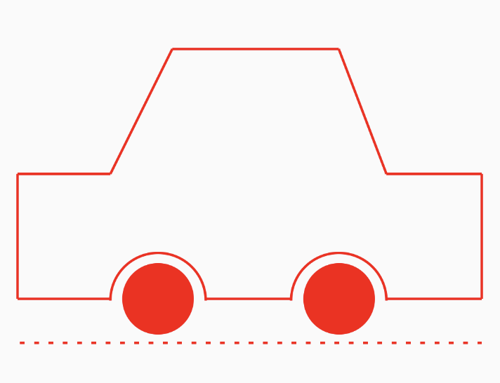

## composeCanvas - Custom Uis

<p align="left"> A Custom UIs made with Jetpack Compose Canvas </p>

### 🖥️ Screenshots

<p align="center">




</p>

## Find this project useful ? ❤️

- Support it by clicking the ⭐️ button on the upper right of this page. ✌️

# License

```markdown
Copyright 2023 Jayant Kumar

Licensed under the Apache License, Version 2.0 (the "License");
you may not use this file except in compliance with the License.
You may obtain a copy of the License at

http://www.apache.org/licenses/LICENSE-2.0

Unless required by applicable law or agreed to in writing, software
distributed under the License is distributed on an "AS IS" BASIS,
WITHOUT WARRANTIES OR CONDITIONS OF ANY KIND, either express or implied.
See the License for the specific language governing permissions and
limitations under the L
